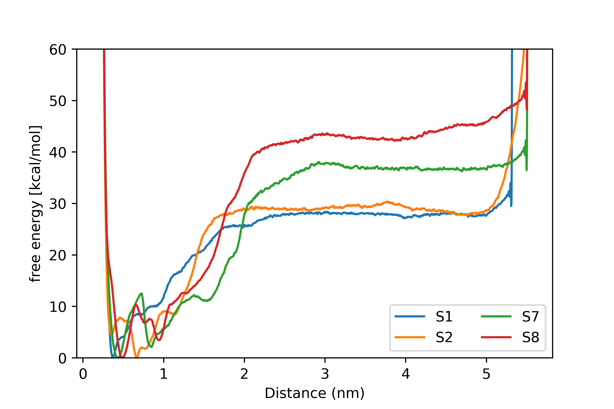

## Funnel Metadynamics 

### Results
| Substrate | Free energy(exp)(Kcal/mol) | Free energy(cal)(Kcal/mol) |
|---|---|---|
| S1 Ac-Phe-NH2 | -2.07 | -2.67 |
| S3 Ac-Phe-Gly-NH2 | -2.52 | -3.54 |
| S6 AC-PRO-ALA-LEU-PHE-NH2 | -3.34 | -3.94 |
| S8 AC-PRO-ALA-PHE-PHE-NH2 | -4.06 | -4.66 |

### PDB and PSF file generation
The PDB structure of alpha-chymotrypsin was downloaded from the Protein Data Bank, at rcsb.org, with a high resolution of 1.68 Å. The entry code is 4cha, which contains the dimer form of the alpha-chymotrypsin with six chains (A, B, C, D, E, and F). Since the monomer of chymotrypsin is biologically relevant, only three unique chains - A, B, and D - were used for all the calculations. The protein structure file (PSF) was generated with the CHARMM36 force field. During this step, two missing residues(12 and 13) of chain A were added, the protonation state of the histidine residue was modified from HIS to HSD, and missing hydrogen atoms were added. 

### Substrate creation
All these substrates were generated in the molefracture panel of the VMD. Finally, the N-terminal and C-terminal of the substrates were modified to acetyl and amide groups, respectively. 
### Molecular docking
The molecular docking was performed in the HADDOCK webserver to create enzyme-substrate complexes. The docking process was guided by providing distance maps between protein and substrate derived from the PDB structure of the chymotrypsin-inhibitor complex (7gch.pdb) to improve the accuracy of the docking mode. 
### Docking validation  
Recent improvements in docking methodology, like water-mediated docking, calculation of protein side-chain flexibility in docking, and ensemble docking, have given molecular docking a reliable tool for predicting the ligand binding modes and binding free energy calculations.   Nevertheless, the poor performance in scoring in ranking ligand binding poses has resulted in inaccuracy in binding calculation and poor correlation with experimental binding free energy calculations, making docking calculations unreliable. Therefore, 300 ns of all-atom molecular dynamics simulation with NAMD 3.0 alpha-12 was performed to get the best binding mode.  
To run molecular dynamics simulation, PSF files were generated with CHARMM 36 force field for all enzyme-substrate complexes as a first step. This was followed by the solvation step, where each complex was solvated in a TIP3P water model and 0.15 M NaCl to provide the biological conditions; counter ions were added to neutralize the charge of the system. In addition to that 30 Å of padding was given on each side of the box to completely solvate the protein and to prevent the protein or ligand from making contact with periodic images of its own. The solvated system contains approximately 107,000 atoms. All these tasks were done in the VMD v1.9.3.  
The minimization step for all complexes was performed in four consecutive steps: in step 1, all the non-water atoms were fixed, and only water molecules were minimized; in step 2, all the atoms of the protein other than hydrogen atoms were fixed, and only water molecules and hydrogen atoms of the protein were minimized; in step 3, the backbone of the protein was fixed, all the atoms other than protein backbone were minimized; in step 4, all the atoms of the system were minimized. Each minimization step was performed until the total energy became plateaued. After minimization, annealing was conducted. During this step, each system was heated gradually from 0 K to 300 K in the NVT ensemble by Langevin dynamics. During this step, little harmonic restraint was provided to the backbone of the protein to prevent the large conformational change. After this step, 2 ns of equilibration step was performed in the NPT ensemble ( T = 300 K and P = 1 bar). Finally, 300 ns of production was done in the NVT ensemble. A cutoff of 12 Å was used to compute the nonbonded interaction, and the Particle-Mesh Ewald (PME) was used when computing the long-range electrostatic interactions. A smooth cutoff of 10 - 12 Å was used with a switching function to treat the van der Waals (vdW) interactions. To use the 2 fs time step, the SHAKE algorithm was used, which prevents the fastest stretching bonds with hydrogen atoms.  
During the simulation, for each system, the position of the substrate was analyzed from time to time. If the substrate can make good contact with protein residues, it would remain docked to the protein. On the other hand, if the docking pose is not good, it cannot make good contact with protein residues. Therefore, the substrate would just leave the active site of the protein during the simulation. Based on this assumption, a good binding mode for each system was extracted from the docking results. Though an initial structure for funnel metadynamics simulation is not crucial for its success, docking was performed to get the enzyme-substrate complex. 
### Trajectory path analysis
To find out the preferred path of the substrate during the unbinding, trajectory data of the unbiased simulation was used. For this purpose, a TCL script called “trajectory_path.tcl” was used to track the center of mass position of the substrate during unbinding. Based on the observation, it was noticed that the substrate leaves the protein close to the turn of the protein, made by residues 96 to 99, from the active site. Moreover, several snapshots of the substrate at various positions, such as binding position and unbinding positions, were also collected. 

### Funnel restraint setup

All the information gathered from the trajectory path analysis was used to construct the funnel restraint. For this purpose, a library file called a funnel.tcl was loaded into VMD, which provides the graphical user interface (GUI) to construct the funnel restraint conveniently.  
As the first step in the construction funnel restraint, the Cartesian coordinates for two points, called A and B, were defined with the help of the GUI panel. Point A defines the origin of the axis of the funnel; point B, further, defines the direction and orientation of the funnel axis in conjunction with point A. After this step, other parameters were defined to construct the funnel restraint. During the construction of the funnel restraint, it was made sure that the volume of the funnel had to be kept as small as possible, without affecting the sampling inside the binding pocket, for fast convergence and accurate results.   Therefore, different parameters were chosen for systems with a small substrate and systems with a large substrate. The cone angle alpha (α) was set to 0.47 rad. The depth of the conical part of the funnel (ZCC) was set to 1.2 nm and 1.5 nm, respectively for the system with small and large substrates. On the other hand, other parameters, including the radius of the cylindrical part (Rcyl), lower wall, upper wall, and force constant of the restraint, were the same for all systems, regardless of their substrate size. In addition to the funnel-shaped restraint, a smooth wall, large enough to prevent the substrate from going out of the funnel restraint, was set on both sides of the funnel. A smooth lower wall and an upper wall with the spring constant of 500,000 kJ/(molnm2) were set at 0 nm and 5.7 nm, respectively to prevent the substrate from exploring outside the region of interest. At the same time, the spring constant of the funnel restraint was defined as 35,100 kJ/(molnm2). During the simulation, funnel potential will be stored in a grid file. Therefore, it is necessary to set the dimension of the grid. The minimum value (Min fps.lp) and the maximum value (Max fps.lp) along the funnel axis were set as -0.5 nm and 6.0 nm, respectively. The Center of mass of the non-hydrogen atoms of the substrate was considered as the ligand.  As funnel metadynamics simulation progress, the algorithm will track the center of mass (COM) position of the substrate to the funnel restraint. However, due to the periodic boundary condition (PBC), the molecule may break into several parts, which will result in the crash of the funnel metadynamics algorithm as the substrate may go out of the funnel restraint. To prevent this from happening, two parameters are usually defined, which are ANCHOR point and WHOLEMOLECULES). An atom of the protein, which is close to the ligand during the unbound state, is defined as an anchor point. This allows, the reconstruction of the substrate along with the anchor point in the same periodic boundary condition. In addition to this, another parameter, called wholemolecules, is used to group the atoms that should be affected by PBC. In this work, atom number 850 (according to the PDB file) was used as an anchor point; and CA atoms of the protein, anchor atom, and all the non-hydrogen atoms of the substrate were given in the wholemolecule parameter. The name of the PDB file which was used to construct the funnel restraint should be given in the configuration file. But, it should contain only the protein molecule without ligand (it should not contain the ligand or water molecules). However, giving all the protein atoms in the file will slow down the speed of the simulation. Therefore, only CA atoms of the protein molecules were given in the reference PDB file. 

### Preliminary metadynamics to extract data
In metadynamics simulation, choosing the key factors, such as height, width, the deposition rate of the gaussian and bias factor, and CV are crucial for its success. Therefore, a careful inspection of the system of interest must be done before conducting any metadynamics simulation.  
For this purpose, before conducting the funnel metadynamics simulation, a set of preliminary unbiased simulations without any funnel restraint was performed to understand the nature of the free energy landscape. Therefore, a plausible value for metadynamics parameters such as the gaussian potential's height, width, and deposition rate can be guessed.  
On top of that since the success of the metadynamics simulation hugely depends on the choice of CV, it is foremost prominent to choose the correct CV that satisfies the criteria. A CV acts as the function of the coordinates of the system (coarse-grained description of the atomic coordinates). Typically, a good CV must satisfy the following criteria: they should be able to distinguish between the initial state, all the intermediate states, and the final state so that a free energy landscape for the process can be constructed; the CV should describe all of the slow modes of the system, allowing faster sampling and convergence; and the number of CVs should be low as possible. If the number of CVs is higher, then it has to explore a higher dimension space, resulting in a reduction of the metadynamics algorithm’s efficiency. Therefore, a good CV must meet those criteria.  
When predicting the binding free energy of ligands, the COM between the ligand and the protein's active site will be chosen as a CV, typically. However, in this study, when the COM distance was used as a CV, a desired free energy landscape was not constructed within a reasonable time. It predicted the global minima far away from the active site. As a result, COM distance could not act as a good CV for this system. Based on this analysis, the distance between the oxygen atom of the Ser-195 residue and the carbonyl carbon of the substrate was chosen as a collective variable (CV). During the preliminary simulations, it was observed that several binding and unbinding events occurred and convergence was reached within a reasonable time. The above observation suggests that the latter CV meets the criteria for a good CV very well.  
After choosing distance as a CV, the probability density of the distance, derived from the short unbiased simulation, was analyzed. Based on the finding, the shape of the initial free energy minima, the one close to the active site, was figured out, and this could be used to guess the width of the well. Therefore, this can be set as the width of the gaussian. However, choosing the width of the metastable basin might not be optimal for other regions, since there are many metastable states available in the system. Therefore, gaussian width was set as one-third of the fraction of the standard deviation of the CV, 0.01 nm. Choosing a wider width would decrease the accuracy of the free energy landscape and narrow width would take a long time to reach the convergence, though it increases the accuracy. The height of the gaussian is chosen as 2 kJ/mol, which is a fraction of the thermal energy, KBT, to prevent the free energy landscape from changing suddenly. The gaussian potential was deposited every 2 ps, which is higher than the autocorrelation time of the CV. Therefore, the accumulation of the potential on top of the previously generated potential can be prevented. Therefore, the free energy landscape can be constructed very smoothly, while achieving high accuracy.  
Apart from the number of CVs, which has a predominant role in deciding the convergence time, it was noticed that the volume of the funnel restraint also affects the convergence time hugely. Accordingly, the volume of the funnel restraint was reduced to the possible minimum, without affecting the sampling inside the binding pocket. However, for larger substrates, the minimum length at which the sampling of the unbound state should be done was higher, which resulted in an increased amount of time needed for convergence significantly. At the same time, the size of the box was also kept larger to prevent the substrate from contacting its image at the unbound state, though it decreased the calculation speed profoundly. It was also noticed that when the size of the box was small with small padding, the funnel metadynamics algorithm encountered so many errors due to the PBC when the substrate was at the unbound state.  
In Funnel metadynamics, each frame of the simulation is aligned with the reference PDB file, which was used to construct the funnel restraint, to track the position of the substrate or ligand to the funnel restrain. Therefore, funnel metadynamics simulation is comparatively slower than normal metadynamics simulation. And all the calculations related to the PLUMED are done on CPU cores, instead of on the GPU. Therefore, to conduct these kinds of simulations, high-performance computing (HPC) is needed to complete the simulation in a reasonable time. In this work, all the simulations were conducted in a cluster computer. Therefore, several replicas of the system with the same parameters, including CV, were allowed to sample parallelly in a multiple-walker fashion to make use of all resources, which are not connected by the high-speed connections, effectively. In the multiple-walker simulation, all walkers with unique IDs will write their output in a separate HILLS file and each will read the HILLS file of the other walkers as well. All these tasks were automated with the help bash script mentioned in the SI. 
Based on the experience gathered during the preliminary simulation, the final setup for the metadynamics simulation was done. 

### Funnel metadynamics simulation
All funnel-metadynamics simulations were performed in NAMD-2.14-multicore-CUDA patched with PLUMED 2.8 funnel metadynamics plug-in. 
Prior to conducting the funnel metadynamics simulation, a standard molecular dynamics simulation, unbiased, with all steps - minimization, annealing, equilibration, and MD - was performed according to the scheme described above. it was made sure that the system was equilibrated by checking the RMSD plot. Therefore, a good initial structure of each system was used in the funnel metadynamics.  
In addition to the parameters related to the funnel restraint, further parameters related to the metadynamics should be defined in the same configuration file. The width (𝝈) of the deposited Gaussian potential is 0.1 Å; the initial height (⍵G)of the Gaussian is 2 kJ/mol; the target temperature is 300 K, and the bias factor is 20. The gaussian potential was deposited (stride,τG) every 1 ps with well-tempered metadynamics simulation. The simulation was conducted in the NVT ensemble. The distance, not the center of mass distance, between the oxygen atom of the Ser-195 residue and the carbonyl carbon of the substrate, was chosen as a collective variable (CV). During the simulation, the deposited gaussian will be stored in the grid file. Therefore, a lower limit and an upper limit for the grid file were defined as -1.5 nm and 7 nm, respectively (this should be higher than the exploration space of the CV)
The initial structure of all walkers was the same. Therefore, each walker was started at a different time to prevent the bias from accumulating at the same place (CV). The simulation was conducted until the free energy difference between the bond state and the unbound state fluctuated at the same value and a number of recrossing events occurred between the bond state and the unbound state.

## Conclusion

In this study, an enhanced sampling method called funnel metadynamics has been successfully used to predict the binding mode of several substrates of chymotrypsin. This method allowed several back-and-forth binding and unbinding events within an affordable computational time by limiting the exploration of the unbound state with a help of funnel-shaped restraint. This led to the construction of the free energy landscape and the absolute ligand-protein binding affinity with high accuracy. In addition to that, in some cases, a reweighting algorithm was used to accurately predict the binding mode of the substrate. Further, pairwise residue interactions (both attractive and repulsive) between protein and substrate were revealed with a help of a python library called grinn@. Instead of explaining the interaction between protein and substrate when the complex is in a static state ( a single PDB file), this tool allowed us to study the interaction from the real trajectory data (dynamic structure) with the help of molecular dynamics engines, such as NAMD and GROMACS.  

### The importance of hydrogen bonds revealed
During the trajectory analysis, it was revealed that hydrogen bonds formed between the substrate and catalytic triad, play a major role in keeping the SER-195 and HIS-57 residues together. Therefore, an oxygen atom of the SER-195 residue can be played close to the carbonyl carbon of the substrate, allowing a better nucleophilic attack on the substrate. Furthermore, several hydrogen bonds formed between a substrate and protein show the important role played by the hydrogen bonds in keeping a substrate in a proper orientation.  

### The importance of the p2 site revealed
By comparing the P2 site with phynylalanine and proline residues, it was revealed that the conformation and orientation of the residue at the P2 site play a major role in keeping the N-terminal of the substrate in a proper orientation so that the N-terminal of the substrate can form a better contact with S3 and S4 pockets of chymotrypsin. It was noticed that the substrate with phenylalanine residue at the P2 site formed better contact with the S2 pocket of chymotrypsin, allowing the P3 and P4 sites of the substrate to form better contact with S3 and S4 pockets of chymotrypsin, respectively. Whereas, the P2 site with a proline residue did not have better contact with the S2 pocket due to its different conformation and orientation. This prevents the N-terminal of the substrate to form strong contact with both S3 and S4 pockets.   

Based on the observation above, it can be seen that both S1 and S1’ pockets of chymotrypsin have deep hydrophobic pockets. Therefore, they can form a lot of contact with the residues at the P1 and P1’ sites. In addition to that when the number of residues close to the different sites of the substrate, such as P2’, P1’, P1, P2, P3, and P4,.., was calculated, it shows that more than 85 residues surrounding both the P1 and P1’ of the substrate, while nearly 60 residues surrounded the P2 and P2’ sites. However, both P3 and P4 sits are surrounded by almost the same number of residues, around 40.   
Accordingly, it can be inferred that both S1 and S1’ sites of chymotrypsin are well designed to be occupied with larger hydrophobic residues. It suggests that both P1 and P1’ sites with larger hydrophobic residues can increase the binding affinity of the substrate considerably. Other pockets, on the other hand, do not have deep hydrophobic pockets. Therefore, their contribution to the binding is limited, except for the P2 site. Therefore, it can be concluded that the contribution of different sites of the substrate decreases in the order P1 >= P1’ > P2 > P2’ > P4 > P3. 
Chymotrypsin is not only used in the digestive system, it has been widely used in the pharmaceutical field as well for treating inflammation, reducing swelling, treating diseases such as asthma, bronchitis, lung diseases, and sinus infections, etc. Therefore, the results obtained from this research can be used to understand how the hydrophobicity of the substrate affects its binding affinity.   
However, determining the overall activity of the enzyme is not only determined by binding affinity (Km), turnover rate (Kcat) also plays a key role. However, Molecular dynamics simulation can be used to predict only the binding affinity (Km) of the reaction. But, predicting the Kcat of the reaction involves quantum mechanical/ molecular mechanical (QM/MM)  calculations, which is out of the scope of this study. 

### VMD selection

mol color Name 
mol representation Lines 1.000000 
mol selection resid 189 to 194 214 to 220 225 to 228 and protein 
mol material Opaque 
mol addrep 0 

mol color Name 
mol representation Licorice 0.300000 12.000000 12.000000 
mol selection resid 57 102 195 and protein 
mol material Opaque 
mol addrep 0 

mol color Name 
mol representation Licorice 0.300000 12.000000 12.000000 
mol selection chain S 
mol material Opaque 
mol addrep 0 
